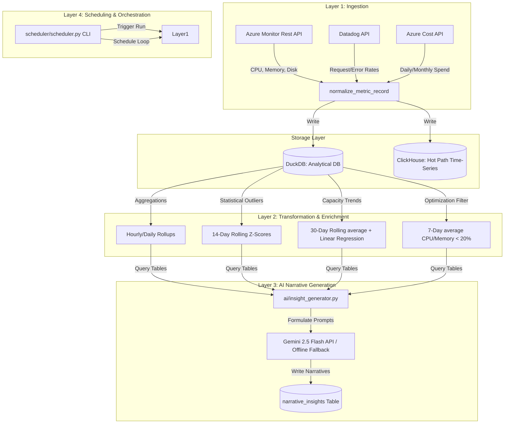

# InfraLens: End-to-End Infrastructure Analytics Platform

InfraLens is a lightweight, high-performance infrastructure analytics platform designed to consolidate telemetry and cost metrics from fragmented sources, execute statistical transformations (anomaly detection and capacity forecasting), and generate plain-language AI narrative insights.

---

## System Architecture

InfraLens is structured into four integrated layers:



---

## Directory Structure

```text
InfraLens/
├── ai/
│   ├── __init__.py
│   ├── gemini.py              # Gemini 2.5 Flash SDK wrapper & local offline fallback generator
│   ├── insight_generator.py   # AI insight coordinator (queries DuckDB -> prompt -> generates narratives)
│   └── prompts.py             # Prompts for Cost Anomaly, Capacity Risk, and Underutilization
├── dashboard/
│   └── PowerBI.pbix           # Power BI Desktop template dashboard
├── database/
│   ├── clickhouse/            # ClickHouse DB runtime references
│   ├── duckdb/                # DuckDB local database files (.db)
│   ├── clickhouse_store.py    # ClickHouse table init, writes, and auto-start logic
│   └── duckdb_store.py        # DuckDB table initialization and writes
├── ingestion/
│   ├── __init__.py
│   ├── azure_cost.py          # Azure Cost Management telemetry fetcher (mock API)
│   ├── azure_monitor.py       # Azure Monitor compute telemetry fetcher (mock API)
│   ├── datadog.py             # Datadog service telemetry fetcher (mock API)
│   ├── runner.py              # Ingestion orchestrator runner (pulls and inserts latest)
│   ├── schema.py              # Shared normalized schema definition
│   └── seed_data.py           # Historical data seeding script (populates 30 days of metrics)
├── scheduler/
│   └── scheduler.py           # Orchestrator CLI and cron schedule loops
├── transformation/
│   ├── aggregate.py           # Hourly and daily metric rollups
│   ├── anomaly.py             # 14-day rolling z-score anomaly detection
│   ├── forecast.py            # 30-day rolling linear regression & capacity risk breach dates
│   └── optimization.py        # 7-day underutilization scoring & savings calculator
├── config.py                  # Project environment configurations
├── requirements.txt           # Python library dependencies
└── README.md                  # This documentation
```

---

## Prerequisites

1. **Python 3.8+**
2. **WSL2 (Windows Subsystem for Linux)** with **Docker Engine** (to host ClickHouse)
3. **Power BI Desktop** (to run the dashboard)

---

## Quick Start Setup

### Step 1: Install Python Dependencies
Create a virtual environment and install the required Python libraries:
```powershell
python -m venv .venv
.venv\Scripts\activate
pip install -r requirements.txt
```

### Step 2: Start ClickHouse in WSL Docker
Run the following WSL2 command to start the ClickHouse database container with explicit default user credentials and access management:
```powershell
wsl docker run -d --name clickhouse-server-lens -p 8123:8123 -p 9000:9000 --ulimit nofile=262144:262144 -e CLICKHOUSE_USER=default -e CLICKHOUSE_PASSWORD=password clickhouse/clickhouse-server
```

### Step 3: Seed the Databases with Historical Telemetry
To run rolling anomaly z-scores, linear regressions, and 7-day utilization averages, seed the database with 30 days of hourly historical data:
```powershell
.venv\Scripts\python.exe -m ingestion.seed_data --days 30
```
*Note: The script automatically detects if the ClickHouse container in WSL is stopped, boots it, pings it until online, and then writes the metrics.*

### Step 4: Run the Pipeline E2E
Execute the E2E pipeline immediately to ingest the latest point-in-time metrics, aggregate them, compute forecast trends, flag anomalies, and generate AI insights:
```powershell
# Set console encoding to UTF-8 for emoji printing support on Windows
$env:PYTHONIOENCODING="utf-8"

.venv\Scripts\python.exe -m scheduler.scheduler --run
```

### Step 5: Verify the Outputs
Run the custom verification script to query DuckDB and display a clean text report summarizing database counts, z-score anomalies, capacity breach projections, optimization VM candidates, and the full text of the generated AI narratives:
```powershell
$env:PYTHONIOENCODING="utf-8"
.venv\Scripts\python.exe verify_output.py
```

---

## Verification & Testing (QA Strategy)

As mandated by the pSiddhi Platform Track QA requirements, the project includes a multi-layered Pytest testing suite covering unit, integration, and E2E checks with $\ge 80\%$ code coverage.

To execute the test suite and check code coverage locally:
```powershell
.venv\Scripts\python.exe -m pytest --cov=. --cov-report=term-missing
```

This test suite covers:
1. **Unit Tests** (`tests/test_ingestion.py`, `tests/test_ai.py`): Test schema structures, normalization types, prompt templates, and AI local offline fallback generators.
2. **Integration Tests** (`tests/test_database.py`): Test active DuckDB raw inserts and live ClickHouse WSL container connectivity.
3. **E2E Tests** (`tests/test_e2e.py`): Test the full data lifecycle from seeding through rollups, anomalies, forecasting, underutilization scoring, to AI narrative generation in a single session.

---

## Scheduler Configuration

To start the scheduler daemon that polls for new metrics and refreshes analytics tables in the background:
```powershell
# Continuous run every 5 minutes
.venv\Scripts\python.exe -m scheduler.scheduler --schedule 5

# Or running a faster simulation loop (every 10 seconds) for demonstration
.venv\Scripts\python.exe -m scheduler.scheduler --schedule-seconds 10
```

---

## Database Schemas & Analytical Tables

All transformed metrics are saved into DuckDB (`database/duckdb/infra.db`) which is queryable directly via ODBC in Power BI:

### 1. `raw_metrics`
Canonical raw data schema populated by the ingestion runner:
- `source` (VARCHAR) - `azure_monitor`, `azure_cost`, `datadog`
- `resource_id` (VARCHAR) - Resource identifier (e.g. `vm-prod-01`, `svc-api-gateway`)
- `metric_name` (VARCHAR) - `cpu_utilization`, `memory_utilization`, `daily_cost`, `request_rate`, `error_rate`
- `value` (DOUBLE) - Raw metric value
- `unit` (VARCHAR) - `percent`, `usd`, `rpm`, etc.
- `timestamp` (TIMESTAMP) - Ingestion timestamp
- `region` (VARCHAR) - Cloud deployment region
- `service_tag` (VARCHAR) - `compute`, `api`, `development`

### 2. `anomaly_alerts`
Surfaces resources deviating significantly from their baseline:
- `timestamp` (TIMESTAMP) - Detection time
- `source` / `resource_id` / `metric_name` / `value` / `region` / `service_tag` (VARCHAR/DOUBLE)
- `z_score` (DOUBLE) - Calculated 14-day rolling z-score
- `severity` (VARCHAR) - `Warning` ($2.0 < |z| \le 3.0$) or `Critical` ($|z| > 3.0$)

### 3. `capacity_forecasts`
Tracks usage trajectories and projects future shortages:
- `resource_id` / `metric_name` / `region` / `service_tag`
- `current_value` (DOUBLE) - Last 30-day rolling average value
- `growth_rate_per_day` (DOUBLE) - Linear regression slope $m$
- `projected_30d` / `projected_60d` / `projected_90d` (DOUBLE) - Forecasted utilization values
- `crosses_80_threshold` (INTEGER) - Flag (0 or 1) indicating if 90d forecast > 80%
- `projected_breach_date` (VARCHAR) - Estimated date of threshold breach (or N/A)

### 4. `underutilized_resources`
Lists right-sizing and decommissioning candidates:
- `resource_id` / `region` / `service_tag`
- `avg_cpu` / `avg_memory` (DOUBLE) - 7-day average utilization
- `daily_cost` (DOUBLE) - Current daily cost of resource
- `potential_monthly_saving` (DOUBLE) - Estimated savings (`daily_cost * 30`)

### 5. `narrative_insights`
Stores plain-language AI narratives generated by Gemini:
- `timestamp` (TIMESTAMP) - Insight generation time
- `scenario` (VARCHAR) - `cost_anomaly`, `capacity_risk`, or `underutilization`
- `resource_id` (VARCHAR) - Resource identifier (NULL for consolidated report)
- `insight_text` (VARCHAR) - Full markdown text generated by the AI

---

## AI Narrative Generation Details

### Gemini 2.5 Flash API Integration
To connect the narrative engine to live AI Studio inference, set the `GEMINI_API_KEY` environment variable:
```powershell
$env:GEMINI_API_KEY="your-gemini-api-key-here"
```

### Local Offline Fallback
If the API key is not set or the network request fails, the pipeline uses a robust **Local Fallback Generator** (`ai/gemini.py`) that extracts details from the analytical tables to format highly detailed, context-specific markdown reports. This ensures complete functionality and zero pipeline downtime during offline testing.
