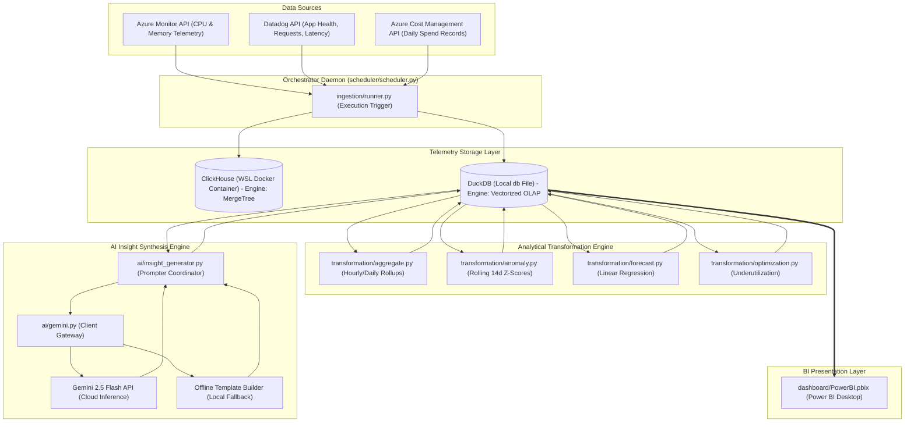
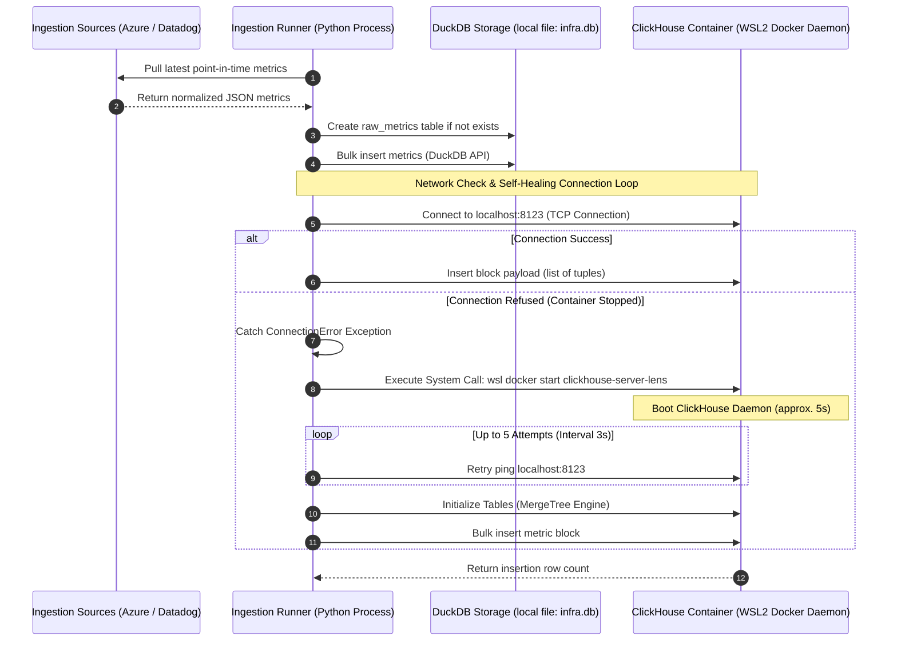
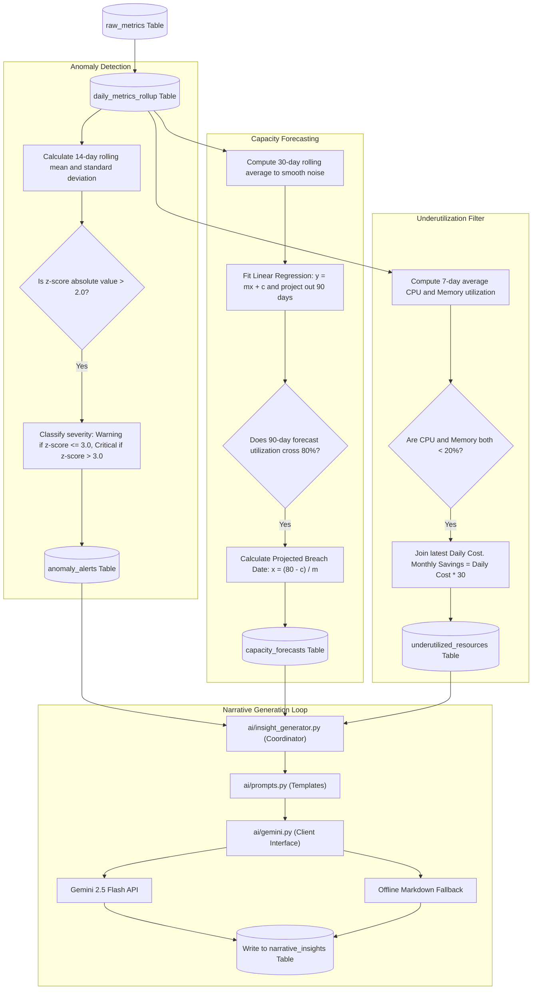
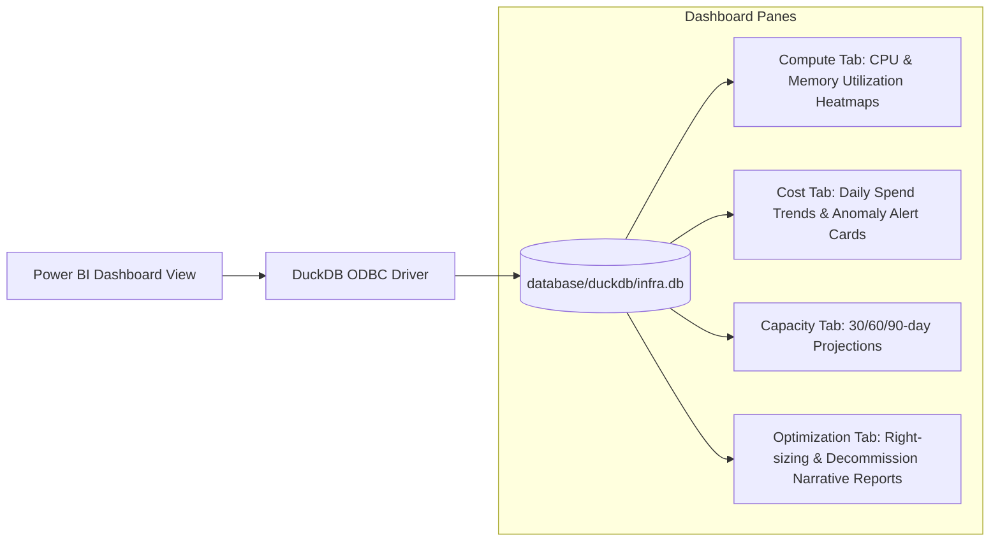

# InfraLens - Overall System Architecture

This document describes the end-to-end data pipelines, storage layout, mathematical transformation procedures, and AI narrative synthesis loops within the **InfraLens** infrastructure analytics platform.

---

## 1. High-Level Data Flow & Presentation Layer

The overall system architecture follows a classic data-warehouse topology: **Extract, Load, Transform, and Synthesize (ELTS)**.

---

## 2. Ingestion & Storage Architecture (Layer 1)

This schema represents the synchronization pathway, highlighting the WSL2 virtual networking setup.

---

## 3. Data Transformation & AI Narrative Flow (Layers 2 & 3)

The transformation pipeline runs inside a single database transaction session (`duckdb.connect`).

---

## 4. Power BI DirectQuery Integration (Layer 4)

Power BI Desktop utilizes the **DuckDB ODBC Driver** to query the transformation results locally:

